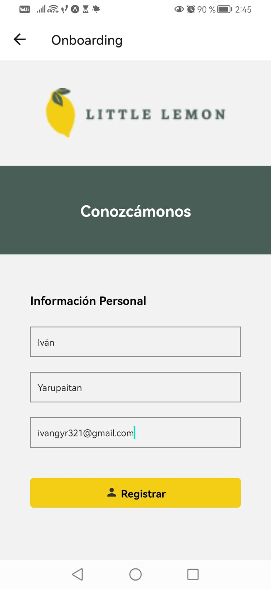
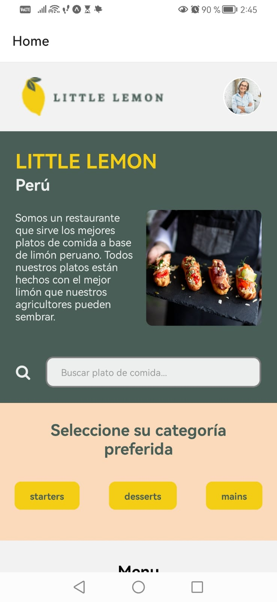
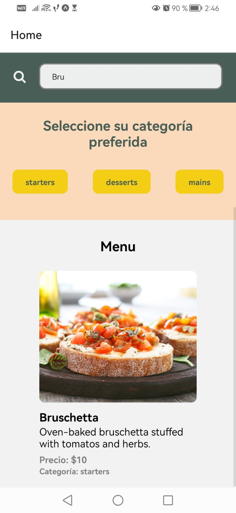
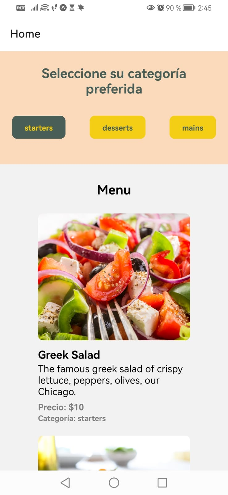
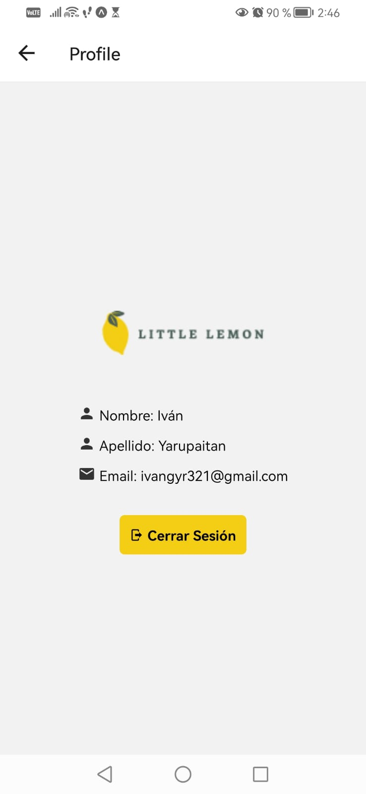

# Nombre del Proyecto

Little Lemon - Una aplicación móvil para explorar y filtrar un menú de un restaurante.

## Descripción

Esta aplicación móvil permite a los usuarios explorar un menú de restaurante y filtrar los platos por categorías. Además, proporciona información sobre el restaurante "Little Lemon" en Perú.

## Capturas de Pantalla







## Características

- Explorar un menú de restaurante.
- Filtrar platos por categorías.
- Ver información detallada de cada plato.

## Instalación

1. Clona este repositorio:

   ```bash
   git clone https://github.com/TuUsuario/LittleLemonApp.git

2. Navega al directorio del proyecto:

   ```bash
   cd LittleLemonApp

3. Instala las dependencias:

   ```bash
   npm install

## Uso

1. Inicia la aplicación:

   ```bash
   npm start

2. Escanea el código QR con la aplicación Expo Go en tu dispositivo móvil.

3. Explora el menú y disfruta de la funcionalidad de filtrado.